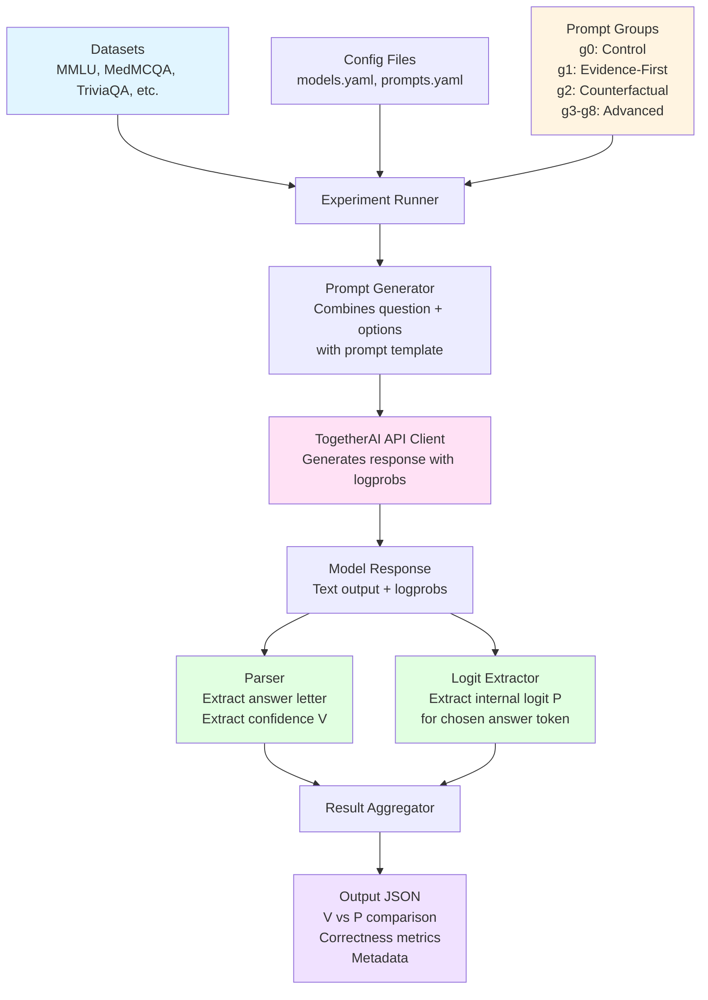

# LLM Trust Gap Research Project

This repository contains code for investigating the "trust gap" in Large Language Models (LLMs), characterized by a disconnect between internal probabilistic uncertainty and external verbal assertions. We use structural prompt engineering to align a model's verbalized confidence (V) with its internal latent probability (P).

## Project Overview

This research evaluates whether structural prompting (evidence-first, counterfactual reasoning, and AI-optimized prompts) can serve as a forcing function for honesty and improve behavioral trustworthiness in LLMs. We extract internal logits from state-of-the-art models via the TogetherAI API and compare them with verbalized confidence scores.

## System Architecture



## Repository Structure

```
llm-trust-gap/
├── .env                    # TogetherAI API key (create from .env.example)
├── dataset/               # JSON dataset files
│   ├── mmlu.json
│   ├── triviaqa.json
│   ├── svamp.json
│   ├── drop.json
│   └── medmcqa_1000.json
├── scripts/               # Dataset extraction scripts
│   ├── extract_mmlu.py
│   ├── extract_triviaqa.py
│   ├── extract_svamp.py
│   └── extract_drop.py
├── prompts/               # Prompt templates for different groups
│   ├── control.py         # Group 0: Baseline vanilla prompt
│   ├── evidence_first.py  # Group 1: Evidence-first prompt
│   ├── counterfactual.py  # Group 2: Counterfactual prompt
│   └── gepa.py            # Group 3: AI-Optimized prompts
├── src/                   # Main source code
│   ├── api_client.py      # TogetherAI API wrapper
│   ├── experiment.py      # Main experiment runner
│   ├── logit_extractor.py # Extract logits for chosen answer
│   ├── parser.py          # Parse model outputs (answer + confidence)
│   └── utils.py           # Helper functions
├── config/                # Configuration files
│   ├── models.yaml        # Model configurations
│   └── prompts.yaml       # Prompt group configurations
└── outputs/               # Experiment results (gitignored)
    └── results/           # JSON output files per experiment
```

## Setup

1. **Clone the repository**

2. **Install dependencies:**
   ```bash
   pip install -r requirements.txt
   ```

3. **Set up environment variables:**
   ```bash
   cp .env.example .env
   # Edit .env and add your TogetherAI API key
   ```

4. **Prepare datasets:**
   Use the extraction scripts in `scripts/` to convert your datasets to the required JSON format:
   ```bash
   python scripts/extract_medmcqa.py
   # Output: dataset/medmcqa_1000.json
   ```

## Dataset Format

All datasets should be JSON files with the following structure:

```json
[
  {
    "question": "What is the capital of France?",
    "options": {
      "A": "London",
      "B": "Berlin",
      "C": "Paris",
      "D": "Madrid"
    },
    "correct_answer": "C",
    "metadata": {
      "source": "MMLU",
      "original_index": 0
    }
  }
]
```

## Running Experiments

Run experiments using the main experiment runner:

```bash
python src/experiment.py \
  --model llama-3.1-8b \
  --prompt-group g0 \
  --dataset dataset/medmcqa_1000.json \
  --output-dir outputs/results
```

### Arguments

- `--model`: Model identifier (see `config/models.yaml` for available models)
  - Options: `llama-3.1-8b`, `llama-3.1-70b`, `mistral-small`, `gemma-3-4b`, `qwen-3-80b`, `deepseek-v3.1`
- `--prompt-group`: Prompt group to use
  - Options: `g0` , `g1`, `g2`, `g3`, `g4`, `g5`, `g6`, `g7`, `g8`
- `--dataset`: Path to JSON dataset file
- `--output-dir`: Directory to save output JSON file (default: `outputs/results`)

## Output Format

Each experiment produces a JSON file named: `{model}_{prompt_group}_{dataset}_{timestamp}.json`

Each entry in the output contains:

```json
{
  "question_id": 0,
  "question": "What is the capital of France?",
  "options": {
    "A": "London",
    "B": "Berlin",
    "C": "Paris",
    "D": "Madrid"
  },
  "gold_answer": "C",
  "outputted_answer": "C",
  "outputted_confidence": 85.0,
  "is_correct": true,
  "internal_logit": -0.005706787,
  "internal_logit_normalized_100": 99.43094657771884,
  "model_output": "C 85%",
  "metadata": {
    "model": "llama-3.1-8b",
    "model_id": "meta-llama/Llama-3.1-8B-Instruct",
    "prompt_group": "g0",
    "dataset": "mmlu"
  }
}
```

## Prompt Groups

1. **Control (Baseline)**: Standard vanilla prompt asking for answer and confidence
2. **Evidence-First**: Requires listing key facts before committing to an answer
3. **Counterfactual**: Assumes initial hypothesis is incorrect to stress-test certainty
4. **GEPA (AI-Optimized)**: Genetic Evolutionary Prompt Algorithms optimized prompts

## Models Supported

- Llama 3.1 (8B, 70B)
- Mistral Small (24B)
- Gemma 3 (4B)
- Qwen 3 (80B)
- DeepSeek V3.1

Model configurations can be found in `config/models.yaml`.

## Key Features

- **Logit Extraction**: Extracts internal logits for the chosen answer token only (A, B, C, or D)
- **Confidence Parsing**: Parsing of output formats: A 64, A 64%
- **Error Handling**: Graceful handling of API failures and parsing errors
- **Modular Design**: Easy to add new prompt groups, models, or datasets

## Development

### Adding New Prompt Groups

1. Create a new file in `prompts/` (e.g., `prompts/my_prompt.py`)
2. Implement a function that takes `(question: str, options: dict)` and returns a prompt string
3. Add it to `prompts/__init__.py` in the `PROMPT_GROUPS` dictionary

### Adding New Models

1. Add model configuration to `config/models.yaml`
2. Use the model identifier when running experiments

### Adding New Datasets

1. Create an extraction script in `scripts/` (following the pattern of existing scripts)
2. Convert your dataset to the required JSON format
3. Place the JSON file in the appropriate `dataset/` subdirectory
